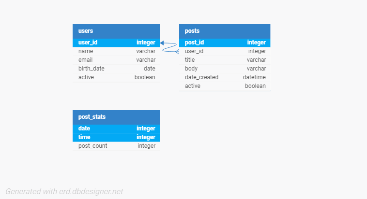

# InManage Assignment

This project, created as an assignment for InManage, demonstrates proficiency in PHP, MySQL, Object-Oriented Programming (OOP), Git, and cURL. It involves building a database with tables for posts and users, populating them with data fetched from an API using cURL. The project includes functionality to display the data, both in its raw form and with applied manipulations, showcasing skills in database management and API integration. The assignment is intended to assess the developer's ability to handle backend development tasks and data handling processes.

## Acknowledgements

 - [BroCode's YouTube Channel](https://www.youtube.com/@BroCodez)
 - [PHP Official Manual](https://www.php.net/manual/en/index.php)
 - [Dani Krossing's YouTube Channel](https://www.youtube.com/@Dani_Krossing)
 - [Joshua Herbison's YouTube Channel](https://www.youtube.com/@jherbison)
 - [InManage](https://www.inmanage.co.il/)

## Authors

- [@Pherom](https://www.github.com/Pherom)

## Installation

Install [XAMPP](https://www.apachefriends.org/index.html) and place the project files in the "htdocs" folder.
In phpMyAdmin, create an empty database called "inmanage_assignment_db".
(If you would like a different name, ensure it matches DB_NAME in config.php.)
    
## FAQ

#### How can I view the posts?

Run the Apache server on your local machine and go to "localhost/\[path to folder containing index.php with htdocs folder as root]"

#### How can I view latest posts by users with current birth month?

Run the Apache server on your local machine and go to "localhost/\[path to birthday.php with htdocs folder as root]"

## Features

- Database table creation in MySQL with PDO
- Fetching data from JSONPlaceholder using cURL
- Gathering post count statistics
- Viewing latest posts by users with current birth month
- Viewing posts in a social media style

## Database Design

## License

[MIT](./LICENSE)

